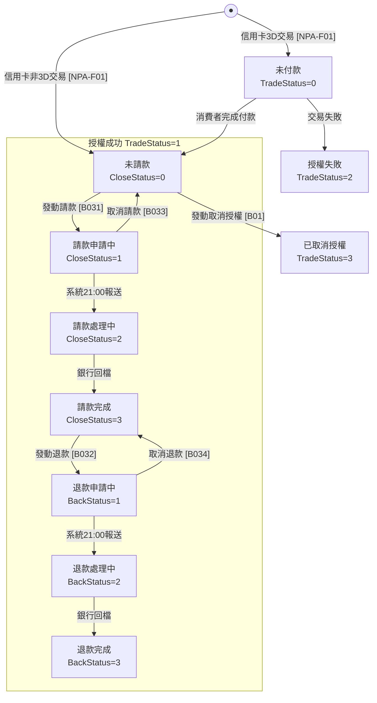
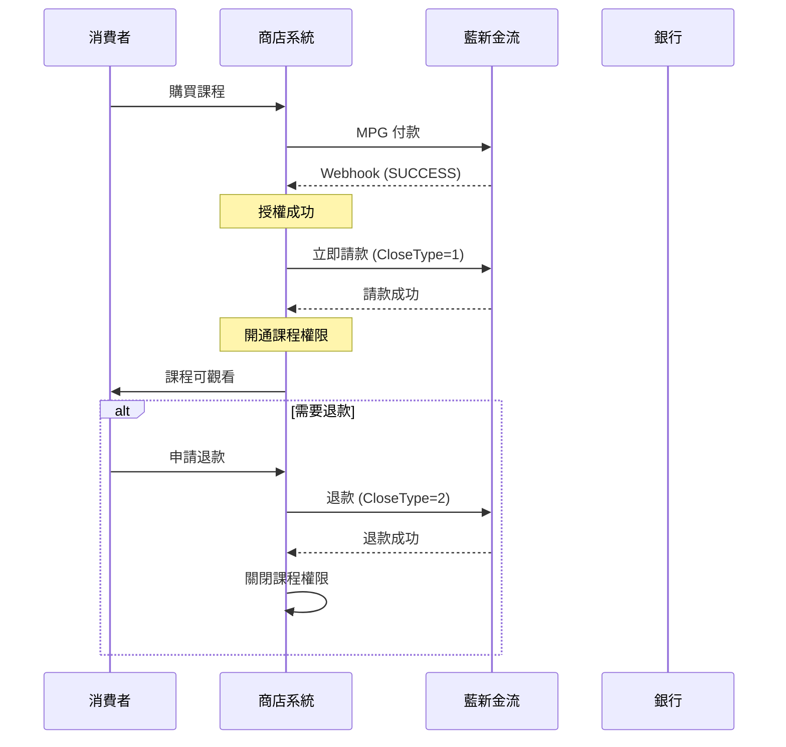
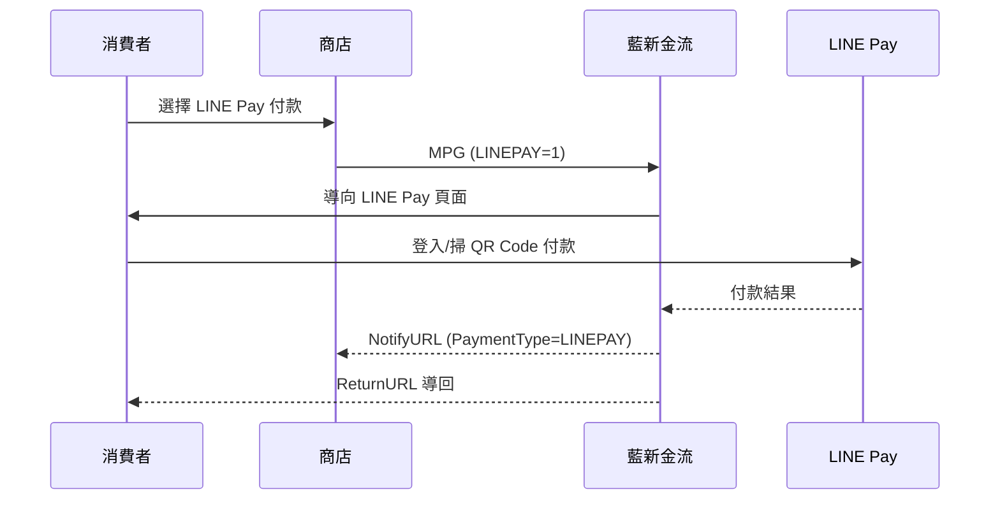
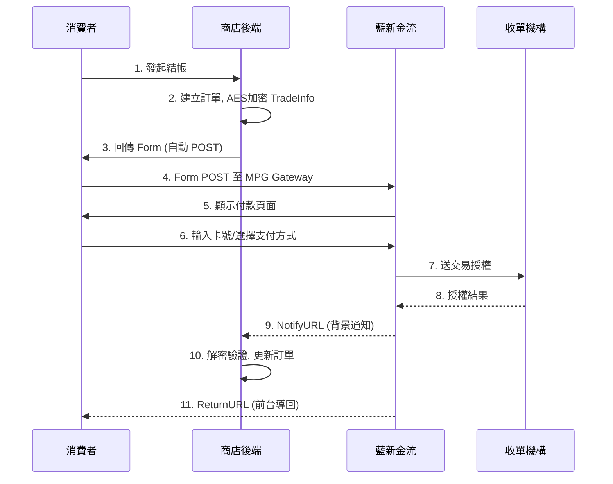

# 藍新金流 NewebPay 串接指南

## 目前支援範圍

| 支付方式 | 狀態 | 說明 |
|----------|------|------|
| 信用卡一次付清 | ✅ 支援 | 主要支援 |
| LINE Pay | 📋 規劃中 | 後續優先支援 |
| 分期付款 | ⏸️ 暫緩 | |
| ATM/超商 | ⏸️ 暫緩 | |
| 其他電子錢包 | ⏸️ 暫緩 | |

## 環境配置

| 環境 | MPG Gateway | Query API | Cancel API | Close API |
|------|-------------|-----------|------------|-----------|
| 測試站 | `https://ccore.newebpay.com/MPG/mpg_gateway` | `https://ccore.newebpay.com/API/QueryTradeInfo` | `https://ccore.newebpay.com/API/CreditCard/Cancel` | `https://ccore.newebpay.com/API/CreditCard/Close` |
| 正式站 | `https://core.newebpay.com/MPG/mpg_gateway` | `https://core.newebpay.com/API/QueryTradeInfo` | `https://core.newebpay.com/API/CreditCard/Cancel` | `https://core.newebpay.com/API/CreditCard/Close` |

**測試卡號**：`4000-2211-1111-1111` (一次付清+分期)、`4003-5511-1111-1111` (紅利)、`3760-000000-00006` (美國運通)

---

## ⚠️ 關鍵業務概念：授權 vs 請款 vs 退款

### 核心流程

```
付款成功 = 授權成功 ≠ 實際扣款
授權成功 → 請款 → 請款完成 → 才能退款
```

### 名詞定義

| 概念 | 說明 | API |
|------|------|-----|
| **授權成功** | 信用卡已授權，銀行尚未實際扣款 | MPG 回傳 SUCCESS |
| **請款** | 通知銀行扣款，錢才會從消費者帳戶扣除 | Close API (CloseType=1) |
| **退款** | 必須在**請款完成後**才能執行 | Close API (CloseType=2) |
| **取消授權** | 放棄扣款，適用於「還沒請款」的情況 | Cancel API |

### ❌ 常見錯誤

若沒有請款，直接退款會發生：
```
TRA10035: 該交易非授權成功或已請款完成狀態，請確認
TRA10047: 該筆交易尚未發動撥款，無法執行退款
```

---

## 信用卡交易狀態機 (圖 5)



> ⚠️ **關鍵**：取消授權 [B01] 只能從「未請款 (CloseStatus=0)」執行，一旦請款就無法取消授權

### 狀態對照表

| 狀態 | TradeStatus | CloseStatus | BackStatus | 可執行操作 | API |
|------|-------------|-------------|------------|-----------|-----|
| 未付款 | 0 | - | - | 等待消費者付款 | - |
| 授權成功/未請款 | 1 | 0 | 0 | 請款、取消授權 | B031, B01 |
| 請款申請中 | 1 | 1 | 0 | 取消請款 | B033 |
| 請款處理中 | 1 | 2 | 0 | (等待銀行) | - |
| 請款完成 | 1 | 3 | 0 | 退款 | B032 |
| 退款申請中 | 1 | 3 | 1 | 取消退款 | B034 |
| 退款處理中 | 1 | 3 | 2 | (等待銀行) | - |
| 退款完成 | 1→6 | 3 | 3 | 無 | - |
| 授權失敗 | 2 | - | - | 無 | - |
| 已取消授權 | 3 | 0 | 0 | 無 | - |

### ⚠️ 重要：批次處理時間

藍新金流系統**每晚 21:00** 會自動向銀行報送：
- 請款申請 (CloseStatus=1 → 2)
- 退款申請 (BackStatus=1 → 2)

這表示：
1. **取消請款/退款**必須在當日 21:00 前執行
2. 超過 21:00 已報送銀行後，無法取消
3. 銀行回檔通常在次日完成

---

## 數位商品建議流程 (EdTech / 線上課程)

對於數位商品（立即交付、無實體出貨），建議：



### 為什麼數位商品要立即請款？

1. **無逆向物流風險**：不像實體商品有運送風險
2. **立即交付**：課程立刻可觀看
3. **簡化退款流程**：避免「授權過期無法請款」的問題
4. **授權有效期限**：通常為 30 天，過期無法請款

---

## LINE Pay 整合說明

### 啟用方式

```typescript
// MPG TradeInfo 參數
{
  LINEPAY: 1,
  ImageUrl: 'https://example.com/product.jpg'  // 可選，84x84 像素
}
```

### 交易流程



### 回應參數 (PaymentType=LINEPAY)

| 參數 | 說明 |
|------|------|
| PaymentType | `LINEPAY` |
| PayTime | 付款時間 |
| ChannelID | LINE Pay 交易識別碼 |

### LINE Pay 退款規則

| 項目 | 說明 |
|------|------|
| 退款期限 | 交易日起 **60 天內** |
| 部分退款 | ✅ 支援多次部分退款 |
| 退款 API | 使用電子錢包退款 [NPA-B06] |
| 立即生效 | 退款立即執行，**無法取消** |

> ⚠️ LINE Pay 退款使用 **JSON encode**，非 http encode

### 測試環境

```
測試交易引導至 LINE Pay 畫面後：
- 登入或掃描 QR Code 進行付款
- 測試交易不支援「模擬觸發」
```

---

## 核心加解密流程

### 1. AES-256-CBC 加密 (請求)

```typescript
import crypto from 'crypto';

function aesEncrypt(data: string, hashKey: string, hashIV: string): string {
  const cipher = crypto.createCipheriv('aes-256-cbc', hashKey, hashIV);
  let encrypted = cipher.update(data, 'utf8', 'hex');
  encrypted += cipher.final('hex');
  return encrypted;
}
```

### 2. SHA256 簽章 (TradeSha)

```typescript
function sha256Hash(aesEncrypted: string, hashKey: string, hashIV: string): string {
  const raw = `HashKey=${hashKey}&${aesEncrypted}&HashIV=${hashIV}`;
  return crypto.createHash('sha256').update(raw).digest('hex').toUpperCase();
}
```

### 3. AES-256-CBC 解密 (回應)

```typescript
function aesDecrypt(encrypted: string, hashKey: string, hashIV: string): string {
  const decipher = crypto.createDecipheriv('aes-256-cbc', hashKey, hashIV);
  let decrypted = decipher.update(encrypted, 'hex', 'utf8');
  decrypted += decipher.final('utf8');
  return decrypted;
}
```

完整加解密腳本：見 `scripts/newebpay-crypto.ts`

---

## MPG 交易流程 [NPA-F01]



### 請求參數 (Form POST)

| 參數 | 必填 | 說明 |
|------|------|------|
| MerchantID | V | 商店代號 (15字元) |
| TradeInfo | V | AES 加密後的交易資料 |
| TradeSha | V | SHA256 簽章 |
| Version | V | 固定 `2.3` |
| EncryptType | - | 0=AES/CBC (預設), 1=AES/GCM |

### TradeInfo 內含參數

詳細參數規格：見 `references/mpg-params.md`

**必填參數**：
- `MerchantID`: 商店代號
- `RespondType`: `JSON` 或 `String`
- `TimeStamp`: Unix 時間戳 (允許誤差 120 秒)
- `Version`: `2.3`
- `MerchantOrderNo`: 訂單編號 (30字元, 英數+底線, 不可重複)
- `Amt`: 金額 (整數, 新台幣)
- `ItemDesc`: 商品描述 (50字元, UTF-8)

**回調 URL**：
- `NotifyURL`: Webhook 背景通知 (必設)
- `ReturnURL`: 付款完成前台導回
- `ClientBackURL`: 取消付款返回

**支付方式開關**：
- `CREDIT=1`: 信用卡一次付清
- `InstFlag=3,6,12`: 分期期別
- `WEBATM=1`: 網路 ATM
- `VACC=1`: ATM 轉帳

---

## Webhook 回調處理 (Notify 機制)

### ⚠️ 重要：Notify 機制規則

```
藍新金流只認 HTTP 200 為 Notify 成功
```

| 項目 | 說明 |
|------|------|
| 成功條件 | 商店回應 **HTTP 200** |
| Retry 機制 | 失敗時重試 **3 次** |
| 失敗通知 | 3 次皆失敗會寄發「Notify 觸發失敗通知信」|
| 非即時支付 | 須等繳費且**銀行銷帳完成**後才會 Notify |

### Notify 失敗常見原因

1. **伺服器未回應 HTTP 200**
   - 回應 500/502/503 等錯誤
   - 回應時間過長導致 timeout

2. **防火牆阻擋**
   - 需開放藍新金流 IP 存取

3. **NotifyURL 設定錯誤**
   - URL 格式錯誤
   - HTTPS 憑證問題

### 建議實作方式

```typescript
// ✅ 正確：先回應 200，再處理業務邏輯
async function handleNotify(req: Request, res: Response) {
  try {
    // 1. 立即回應 200 (避免 timeout)
    res.status(200).send('OK');
    
    // 2. 背景處理業務邏輯
    const result = await processNotify(req.body);
    
    // 3. 若處理失敗，記錄 log 供人工處理
    if (!result.success) {
      await logFailedNotify(req.body, result.error);
    }
  } catch (error) {
    // 即使出錯也已回應 200，需記錄 log
    await logFailedNotify(req.body, error);
  }
}

// ❌ 錯誤：處理完才回應（可能 timeout）
async function handleNotifyBad(req: Request, res: Response) {
  await processNotify(req.body);  // 可能很久
  await updateDatabase();          // 可能很久
  res.status(200).send('OK');      // 太晚了！
}
```

### 驗證流程 (重要!)

```typescript
async function handleNotify(body: NotifyPayload) {
  // 1. 驗證 TradeSha
  const expectedSha = sha256Hash(body.TradeInfo, HASH_KEY, HASH_IV);
  if (body.TradeSha !== expectedSha) {
    throw new Error('簽章驗證失敗');
  }

  // 2. 解密 TradeInfo
  const decrypted = aesDecrypt(body.TradeInfo, HASH_KEY, HASH_IV);
  const result = parseTradeInfo(decrypted); // URL decode + JSON parse

  // 3. 二次驗證金額 (防竄改)
  const order = await getOrder(result.MerchantOrderNo);
  if (order.amount !== result.Amt) {
    throw new Error('金額不符');
  }

  // 4. 冪等性處理
  if (order.status === 'PAID') {
    return { status: 'OK' }; // 已處理過
  }

  // 5. 更新訂單狀態
  if (result.Status === 'SUCCESS') {
    await updateOrderStatus(order.id, 'PAID', result);
    
    // 6. 數位商品：立即請款
    if (isDigitalProduct(order)) {
      await requestPaymentCapture(result.TradeNo, result.Amt);
    }
  }

  return { status: 'OK' }; // 必須回應 HTTP 200
}
```

### 回應參數 (支付完成)

| 參數 | 說明 |
|------|------|
| Status | `SUCCESS` 或 錯誤代碼 |
| MerchantID | 商店代號 |
| TradeNo | 藍新交易序號 (20字元) |
| MerchantOrderNo | 商店訂單編號 |
| Amt | 交易金額 |
| PaymentType | `CREDIT`/`WEBATM`/`VACC` 等 |
| PayTime | 付款時間 `yyyy-MM-dd HH:mm:ss` |

**信用卡專屬**：`Auth` (授權碼)、`Card6No`、`Card4No`、`AuthBank`、`RespondCode`

完整回應參數：見 `references/response-params.md`

---

## 其他 API

### 交易查詢 [NPA-B02]

使用 CheckValue 驗證 (非 TradeInfo 加密)

```typescript
// CheckValue = SHA256(IV={HashIV}&Amt=...&MerchantID=...&MerchantOrderNo=...&Key={HashKey})
const raw = `IV=${HASH_IV}&Amt=${amt}&MerchantID=${merchantId}&MerchantOrderNo=${orderNo}&Key=${HASH_KEY}`;
const checkValue = crypto.createHash('sha256').update(raw).digest('hex').toUpperCase();
```

### 請退款 [NPA-B031~34]

| 操作 | CloseType | Cancel | 說明 |
|------|-----------|--------|------|
| 請款 (B031) | 1 | - | 授權成功後執行 |
| 退款 (B032) | 2 | - | **請款完成後**才能執行 |
| 取消請款 (B033) | 1 | 1 | 請款處理中可取消 |
| 取消退款 (B034) | 2 | 1 | 退款處理中可取消 |

### 請退款金額限制

| 交易類型 | 請款 | 退款 |
|----------|------|------|
| 一次付清 (含三大 Pay/國外卡) | 整筆或部分 | 整筆或部分 |
| 分期付款 | 僅整筆 | 僅整筆 |
| 紅利折抵 | 僅整筆 | 僅整筆 |
| 銀聯卡 | 僅整筆 | 整筆或部分 |

詳細規格：見 `references/other-apis.md`

---

## 安全檢查清單

- [ ] Webhook 簽章驗證 (TradeSha 比對)
- [ ] 訂單金額二次驗證
- [ ] 冪等性處理 (同筆交易重複通知)
- [ ] HTTPS 強制 (ReturnURL/NotifyURL)
- [ ] 敏感資料不落地 (卡號由藍新處理)
- [ ] TimeStamp 120 秒內有效
- [ ] 禁止 iframe/proxy 使用 MPG 頁面
- [ ] 請款前確認交易狀態

---

## 常見錯誤代碼 (重要)

### 狀態相關錯誤

| 代碼 | 原因 | 處理建議 |
|------|------|----------|
| TRA10035 | 該交易非授權成功或已請款完成狀態 | 查詢交易狀態再操作 |
| TRA10047 | 該筆交易尚未發動撥款，無法執行退款 | 先執行請款 |
| TRA10026 | 此訂單非授權成功狀態，不可請款 | 確認授權是否成功 |
| TRA10027 | 此訂單已申請過請款，不可重覆請款 | 檢查請款狀態 |

### MPG 常見錯誤

| 代碼 | 原因 |
|------|------|
| MPG01002 | TimeStamp 空白 |
| MPG01012 | 訂單編號格式錯誤 |
| MPG01015 | 金額錯誤或超過限額 |
| MPG02004 | 頁面逾時 (超過 120 秒) |
| MPG02005 | 來源不合法 (禁用 iframe) |

### 速率限制錯誤

| 代碼 | 原因 | 解鎖時間 |
|------|------|----------|
| TRA10071 | 查詢次數過多已鎖定 | 4 小時 |
| TRA10702 | 請退款次數過多已鎖定 | 1 小時 |

完整錯誤代碼：見 `references/error-codes.md`

---

## 資源參考

- **加解密腳本**: `scripts/newebpay-crypto.ts`
- **MPG 參數規格**: `references/mpg-params.md`
- **回應參數規格**: `references/response-params.md`
- **其他 API 規格**: `references/other-apis.md`
- **錯誤代碼表**: `references/error-codes.md`
