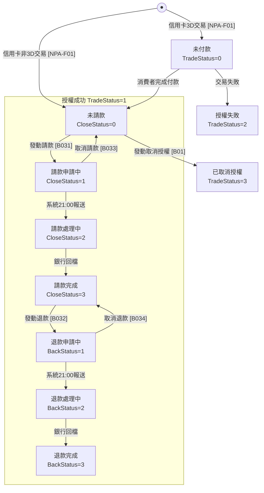

# 其他 API 規格

## 信用卡交易狀態圖 (圖 5)



> ⚠️ **關鍵**：取消授權 [B01] 只能從「未請款 (CloseStatus=0)」執行

### 狀態值說明

| TradeStatus | CloseStatus | BackStatus | 狀態名稱 |
|-------------|-------------|------------|----------|
| 0 | - | - | 未付款 (3D 交易等待中) |
| 1 | 0 | 0 | 授權成功/未請款 |
| 1 | 1 | 0 | 請款申請中 |
| 1 | 2 | 0 | 請款處理中 |
| 1 | 3 | 0 | 請款完成 |
| 1 | 3 | 1 | 退款申請中 |
| 1 | 3 | 2 | 退款處理中 |
| 1 | 3 | 3 | 退款完成 |
| 2 | - | - | 授權失敗 |
| 3 | 0 | 0 | 已取消授權 |

## API 與狀態對照表

| 目前狀態 | 可執行 API | CloseType | Cancel | 結果狀態 |
|----------|-----------|-----------|--------|----------|
| 未請款 (CloseStatus=0) | 請款 [B031] | 1 | - | 請款申請中 |
| 未請款 (CloseStatus=0) | 取消授權 [B01] | - | - | 已取消授權 |
| 請款申請中 (CloseStatus=1) | 取消請款 [B033] | 1 | 1 | 未請款 |
| 請款完成 (CloseStatus=3) | 退款 [B032] | 2 | - | 退款申請中 |
| 退款申請中 (BackStatus=1) | 取消退款 [B034] | 2 | 1 | 請款完成 |

### ⚠️ 批次處理時間

藍新系統**每晚 21:00** 自動向銀行報送：
- 請款申請 (CloseStatus: 1 → 2)
- 退款申請 (BackStatus: 1 → 2)

**重要限制**：
- 取消請款/退款必須在**當日 21:00 前**執行
- 報送銀行後狀態變為「處理中」，無法再取消
- 銀行回檔通常在**次日**完成

---

## 單筆交易查詢 [NPA-B02]

### 端點

| 環境 | URL |
|------|-----|
| 測試站 | `https://ccore.newebpay.com/API/QueryTradeInfo` |
| 正式站 | `https://core.newebpay.com/API/QueryTradeInfo` |

### 請求參數 (Form POST)

| 參數 | 中文名稱 | 必填 | 型態 | 說明 |
|------|----------|------|------|------|
| MerchantID | 商店代號 | V | String(15) | 藍新金流商店代號 |
| Version | 版本 | V | String(5) | `1.3` |
| RespondType | 回傳格式 | V | String(6) | `JSON` 或 `String` |
| CheckValue | 檢查碼 | V | String(255) | 見下方說明 |
| TimeStamp | 時間戳記 | V | String(50) | Unix 時間戳 (容許 120 秒誤差) |
| MerchantOrderNo | 商店訂單編號 | V | String(30) | 要查詢的訂單編號 |
| Amt | 訂單金額 | V | Int(10) | 該筆訂單金額 |
| Gateway | 資料來源 | - | String(10) | 複合式商店填 `Composite` |

### CheckValue 產生規則

```typescript
// 1. 參數依 A-Z 排序
const params = `Amt=${amt}&MerchantID=${merchantId}&MerchantOrderNo=${orderNo}`;

// 2. 加上 IV= 和 Key= (注意：不是 HashIV= 和 HashKey=)
const raw = `IV=${HASH_IV}&${params}&Key=${HASH_KEY}`;

// 3. SHA256 轉大寫
const checkValue = crypto.createHash('sha256').update(raw).digest('hex').toUpperCase();
```

### 回應參數

| 參數 | 中文名稱 | 型態 | 說明 |
|------|----------|------|------|
| Status | 回傳狀態 | String(10) | `SUCCESS` 或錯誤代碼 |
| Message | 回傳訊息 | String(30) | 查詢結果描述 |
| Result | 回傳內容 | Object | 交易詳細資訊 |

### Result 內含參數

| 參數 | 中文名稱 | 型態 | 說明 |
|------|----------|------|------|
| MerchantID | 商店代號 | String(15) | |
| Amt | 交易金額 | Int(10) | |
| TradeNo | 藍新交易序號 | String(20) | |
| MerchantOrderNo | 商店訂單編號 | String(30) | |
| TradeStatus | 支付狀態 | String(1) | 見下方說明 |
| PaymentType | 支付方式 | String(10) | CREDIT/VACC/WEBATM 等 |
| CreateTime | 交易建立時間 | DateTime | `yyyy-MM-dd HH:mm:ss` |
| PayTime | 支付完成時間 | DateTime | |
| FundTime | 預計撥款日 | Date | `yyyy-MM-dd` |
| CheckCode | 檢核碼 | Hash | 用於驗證回傳資料 |

### TradeStatus 支付狀態

| 值 | 說明 |
|----|------|
| 0 | 未付款 |
| 1 | 付款成功 |
| 2 | 付款失敗 |
| 3 | 取消付款 |
| 6 | 退款 |

### 信用卡專屬回應參數

| 參數 | 中文名稱 | 型態 | 說明 |
|------|----------|------|------|
| RespondCode | 金融機構回應碼 | String(10) | |
| Auth | 授權碼 | String(10) | |
| ECI | ECI 值 | String(1) | 1,2,5,6 代表 3D 交易 |
| CloseAmt | 請款金額 | Int(10) | 已請款金額 |
| CloseStatus | 請款狀態 | Int(1) | 見下方說明 |
| BackBalance | 可退款餘額 | Int(10) | |
| BackStatus | 退款狀態 | Int(1) | 見下方說明 |
| Inst | 分期期別 | String(3) | |
| RespondMsg | 授權結果訊息 | String(50) | |

### CloseStatus 請款狀態

| 值 | 說明 |
|----|------|
| 0 | 未請款 |
| 1 | 等待提送請款至收單機構 / 請款處理中 |
| 2 | 請款處理中 |
| 3 | 請款完成 |
| 4 | 請款失敗 (電子錢包) |

### BackStatus 退款狀態

| 值 | 說明 |
|----|------|
| 0 | 未退款 |
| 1 | 等待提送退款至收單機構 |
| 2 | 退款處理中 |
| 3 | 退款完成 |
| 4 | 退款失敗 (電子錢包) |

---

## 取消授權 [NPA-B021]

> ⚠️ **注意**：僅適用於「尚未請款」的交易

### 端點

| 環境 | URL |
|------|-----|
| 測試站 | `https://ccore.newebpay.com/API/CreditCard/Cancel` |
| 正式站 | `https://core.newebpay.com/API/CreditCard/Cancel` |

### 請求參數 (Form POST)

| 參數 | 中文名稱 | 必填 | 型態 | 說明 |
|------|----------|------|------|------|
| MerchantID_ | 商店代號 | V | String(15) | 注意有底線 |
| PostData_ | 加密資料 | V | Text | AES 加密的參數 |

### PostData_ 內含參數

| 參數 | 中文名稱 | 必填 | 型態 | 說明 |
|------|----------|------|------|------|
| RespondType | 回傳格式 | V | String(5) | `String` 或 `JSON` |
| Version | 版本 | V | String(5) | `1.0` |
| Amt | 交易金額 | V | Int(10) | 原交易金額，須與授權金額相同 |
| MerchantOrderNo | 商店訂單編號 | + | String(30) | IndexType=1 時填入 |
| TradeNo | 藍新交易序號 | + | String(20) | IndexType=2 時填入 |
| IndexType | 單號類別 | V | Int(1) | 1=商店訂單編號, 2=藍新交易序號 |
| TimeStamp | 時間戳記 | V | String(30) | Unix 時間戳 (容許 120 秒誤差) |

### 回應參數

| 參數 | 中文名稱 | 型態 | 說明 |
|------|----------|------|------|
| Status | 回傳狀態 | String(10) | `SUCCESS` 或 `TRA20001` 或錯誤代碼 |
| Message | 回傳訊息 | String(30) | 取消授權狀態描述 |
| Result | 回傳資料 | Array | |

### Result 內含參數

| 參數 | 中文名稱 | 型態 | 說明 |
|------|----------|------|------|
| MerchantID | 商店代號 | String(15) | |
| TradeNo | 藍新交易序號 | String(20) | |
| Amt | 交易金額 | Int(15) | |
| MerchantOrderNo | 商店訂單編號 | String(30) | |
| CheckCode | 檢核碼 | Hash | 用於驗證 |

### 特殊回應碼

| 代碼 | 說明 |
|------|------|
| SUCCESS | 取消授權成功 |
| TRA20001 | 取消授權需批次處理 (**非錯誤**，等待銀行處理) |

---

## 請退款/取消請退款 [NPA-B031~34]

> ⚠️ **重要**：退款 (B032) 必須在**請款完成後**才能執行

### 端點

| 環境 | URL |
|------|-----|
| 測試站 | `https://ccore.newebpay.com/API/CreditCard/Close` |
| 正式站 | `https://core.newebpay.com/API/CreditCard/Close` |

### 功能編號對照

| 功能 | 編號 | CloseType | Cancel | 前置條件 |
|------|------|-----------|--------|----------|
| 信用卡請款 | B031 | 1 | - | CloseStatus=0 |
| 信用卡退款 | B032 | 2 | - | **CloseStatus=3** |
| 取消請款 | B033 | 1 | 1 | CloseStatus=1~2 |
| 取消退款 | B034 | 2 | 1 | BackStatus=1~2 |

### 請求參數 (Form POST)

| 參數 | 中文名稱 | 必填 | 型態 | 說明 |
|------|----------|------|------|------|
| MerchantID_ | 商店代號 | V | String(15) | 注意有底線 |
| PostData_ | 加密資料 | V | Text | AES 加密的參數 |

### PostData_ 內含參數

| 參數 | 中文名稱 | 必填 | 型態 | 說明 |
|------|----------|------|------|------|
| RespondType | 回傳格式 | V | String(5) | `String` 或 `JSON` |
| Version | 版本 | V | String(5) | `1.1` |
| Amt | 請退款金額 | V | Int(10) | 見下方金額限制 |
| MerchantOrderNo | 商店訂單編號 | + | String(30) | IndexType=1 時填入 |
| TradeNo | 藍新交易序號 | + | String(20) | IndexType=2 時填入 |
| IndexType | 單號類別 | V | Int(1) | 1=商店訂單編號, 2=藍新交易序號 |
| TimeStamp | 時間戳記 | V | String(30) | Unix 時間戳 (容許 120 秒誤差) |
| CloseType | 請退款類別 | V | Int(1) | 1=請款, 2=退款 |
| Cancel | 取消請退款 | - | Int(1) | 1=取消 (僅 B033/B034 使用) |

### 請退款金額限制

| 交易類型 | 請款 | 退款 |
|----------|------|------|
| 一次付清 (含三大 Pay/國外卡) | 整筆或**部分** | 整筆或**部分** |
| 分期付款 | 僅**整筆** | 僅**整筆** |
| 紅利折抵 | 僅**整筆** | 僅**整筆** |
| 銀聯卡 | 僅**整筆** | 整筆或**部分** |

### 回應參數

| 參數 | 中文名稱 | 型態 | 說明 |
|------|----------|------|------|
| Status | 回傳狀態 | String(10) | `SUCCESS` 或錯誤代碼 |
| Message | 回傳訊息 | String(30) | 請退款訊息 |
| Result | 回傳資料 | JSON | |

### Result 內含參數

| 參數 | 中文名稱 | 型態 | 說明 |
|------|----------|------|------|
| MerchantID | 商店代號 | String(15) | |
| Amt | 請退款金額 | Int(10) | 本次請退款金額 |
| TradeNo | 藍新交易序號 | String(20) | |
| MerchantOrderNo | 商店訂單編號 | String(30) | |

### 回傳結果範例

```
Status=SUCCESS&Message=請款資料新增成功_模擬信用卡請款成功&MerchantID=MS12345678&Amt=30&MerchantOrderNo=MyCompanyOrder11646990440&TradeNo=22031117215409023
```

---

## 電子錢包退款 [NPA-B06]

### 退款規則

| 電子錢包 | 可退款時機 | 退款期限 | 部分退款 |
|----------|-----------|----------|----------|
| 玉山 Wallet | 交易完成 10 分鐘後 | 89 天內 | ✅ 支援 |
| 台灣 Pay | 交易完成 10 分鐘後 | 29 天內 | ❌ 僅全額 |
| LINE Pay | 立即 | 60 天內 | ✅ 支援 |
| ezPay/Alipay/WeChat | 立即 | 89 天內 | ✅ 支援 |
| TWQR | 立即 | 89 天內 | ✅ 支援 |

> ⚠️ **台灣 Pay 注意**：發動退款時，商店當日銷售金額需 >= 退款金額

### 端點

| 環境 | URL |
|------|-----|
| 測試站 | `https://ccore.newebpay.com/API/EWallet/refund` |
| 正式站 | `https://core.newebpay.com/API/EWallet/refund` |

### 請求參數 (Form POST)

| 參數 | 中文名稱 | 必填 | 型態 | 說明 |
|------|----------|------|------|------|
| UID_ | 商店代號 | V | String(15) | 注意命名不同 |
| Version_ | 版本 | V | String(5) | `1.1` |
| EncryptData_ | 加密資料 | V | Text | AES 加密的參數 (**JSON Encode**) |
| RespondType_ | 回傳格式 | V | String(15) | `JSON` |
| HashData_ | 雜湊資料 | V | Text | SHA256 簽章 |

> ⚠️ **重要**：此 API 使用 **JSON Encode** 而非 http Encode

### EncryptData_ 內含參數

| 參數 | 中文名稱 | 必填 | 型態 | 說明 |
|------|----------|------|------|------|
| MerchantOrderNo | 商店訂單編號 | V | String(30) | 原訂單編號 |
| Amount | 退款金額 | V | Int(10) | 台灣 Pay 須等於訂單金額 |
| TimeStamp | 時間戳記 | V | String(50) | Unix 時間戳 |
| PaymentType | 付款方式 | V | String | 見下方代碼 |

### PaymentType 代碼

| 代碼 | 說明 |
|------|------|
| ESUNWALLET | 玉山 Wallet |
| LINEPAY | LINE Pay |
| TAIWANPAY | 台灣 Pay |
| TWQR | TWQR |
| EZPALIPAY | 支付寶 |
| EZPWECHAT | 微信 |

### HashData_ 產生規則

```typescript
// 注意：順序與信用卡不同
const hashString = `HashKey=${HASH_KEY}&${encryptedData}&HashIV=${HASH_IV}`;
const hashData = crypto.createHash('sha256').update(hashString).digest('hex').toUpperCase();
```

### 回應參數

| 參數 | 中文名稱 | 型態 | 說明 |
|------|----------|------|------|
| Status | 回傳狀態 | String(10) | `1000` = 成功 |
| Message | 回傳訊息 | String(30) | 退款訊息 |
| EncryptData | 加密資料 | Text | 需解密 |
| HashData | 雜湊資料 | Text | 用於驗證 |
| UID | 商店代號 | String(15) | |
| Version | 版本 | String(5) | |

### EncryptData 解密後參數

| 參數 | 中文名稱 | 型態 | 說明 |
|------|----------|------|------|
| TradeNo | 藍新交易序號 | String(20) | |
| BankMessage | 銀行回傳訊息 | String(30) | |
| BankCode | 銀行回傳代碼 | String(10) | |
| MerchantOrderNo | 商店訂單編號 | String(30) | |
| RefundAmount | 退款金額 | Int(10) | |
| RefundDate | 退款日期 | String(19) | `yyyy-MM-dd HH:mm:ss` |

---

## LINE Pay 退款範例

> LINE Pay 是最可能優先支援的電子錢包，以下為詳細退款範例

### TypeScript 實作

```typescript
import crypto from 'crypto';

interface LinePayRefundParams {
  MerchantOrderNo: string;
  Amount: number;
  TimeStamp: number;
  PaymentType: 'LINEPAY';
}

async function refundLinePay(
  orderNo: string,
  amount: number,
  config: { merchantId: string; hashKey: string; hashIV: string }
): Promise<RefundResult> {
  // 1. 準備參數 (使用 JSON encode，非 http encode!)
  const params: LinePayRefundParams = {
    MerchantOrderNo: orderNo,
    Amount: amount,
    TimeStamp: Math.floor(Date.now() / 1000),
    PaymentType: 'LINEPAY',
  };
  
  // 2. JSON 轉字串後加密
  const jsonString = JSON.stringify(params);
  const encryptData = aesEncrypt(jsonString, config.hashKey, config.hashIV);
  
  // 3. 產生 HashData
  const hashString = `HashKey=${config.hashKey}&${encryptData}&HashIV=${config.hashIV}`;
  const hashData = crypto.createHash('sha256').update(hashString).digest('hex').toUpperCase();
  
  // 4. 發送請求
  const response = await fetch('https://core.newebpay.com/API/EWallet/refund', {
    method: 'POST',
    headers: { 'Content-Type': 'application/x-www-form-urlencoded' },
    body: new URLSearchParams({
      'UID_': config.merchantId,
      'Version_': '1.1',
      'EncryptData_': encryptData,
      'RespondType_': 'JSON',
      'HashData_': hashData,
    }),
  });
  
  const result = await response.json();
  
  // 5. 解密回應
  if (result.Status === '1000') {
    const decrypted = aesDecrypt(result.EncryptData, config.hashKey, config.hashIV);
    return JSON.parse(decrypted);
  }
  
  throw new Error(`LINE Pay 退款失敗: ${result.Message}`);
}
```

### LINE Pay 退款規則

| 項目 | 說明 |
|------|------|
| 退款期限 | 交易日起 **60 天內** |
| 部分退款 | ✅ 支援多次部分退款 |
| 退款生效 | **立即執行，無法取消** |
| 退款時機 | 交易完成後立即可退 |

---

## CheckCode 產生規則 (通用驗證)

用於驗證回傳資料的正確性。

```typescript
// 1. 取四個欄位依 A-Z 排序
const checkCode = {
  Amt: result.Amt,
  MerchantID: result.MerchantID,
  MerchantOrderNo: result.MerchantOrderNo,
  TradeNo: result.TradeNo
};

// 2. 排序後組成字串
const sortedKeys = Object.keys(checkCode).sort();
const checkStr = sortedKeys.map(k => `${k}=${checkCode[k]}`).join('&');

// 3. 加上 HashIV 和 HashKey
const raw = `HashIV=${HASH_IV}&${checkStr}&HashKey=${HASH_KEY}`;

// 4. SHA256 轉大寫
const generatedCode = crypto.createHash('sha256').update(raw).digest('hex').toUpperCase();

// 5. 比對
if (generatedCode !== result.CheckCode) {
  throw new Error('CheckCode 驗證失敗');
}
```

---

## 常見錯誤代碼對照

### 請款相關

| 代碼 | 原因 | 處理方式 |
|------|------|----------|
| TRA10026 | 此訂單非授權成功狀態 | 確認授權是否成功 |
| TRA10027 | 已申請過請款 | 檢查 CloseStatus |
| TRA10028 | 請款金額超過授權金額 | 調整金額 |
| TRA10029 | 請款超過授權日 | 無法請款，需重新交易 |
| TRA10048 | 該交易正在請款狀態 | 等待處理完成 |

### 退款相關

| 代碼 | 原因 | 處理方式 |
|------|------|----------|
| TRA10035 | 該交易非授權成功或已請款完成狀態 | **先執行請款** |
| TRA10047 | 該筆交易尚未發動撥款 | **先執行請款** |
| TRA10036 | 已超過剩餘可退款金額 | 檢查已退款金額 |
| TRA10039 | 退款金額超過請款金額 | 調整金額 |
| TRA10049 | 該交易正在退款狀態 | 等待處理完成 |

### 取消授權相關

| 代碼 | 原因 | 說明 |
|------|------|------|
| TRA20001 | 取消授權需批次處理 | **非錯誤**，等待銀行 |
| TRA20005 | 該筆交易已請款 | 無法取消，需用退款 |
| TRA20007 | 該筆交易已取消授權 | 重複操作 |
