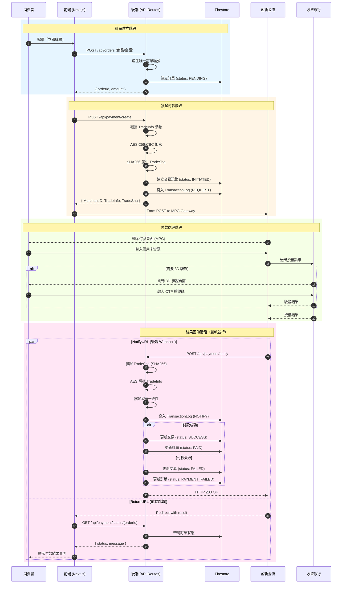
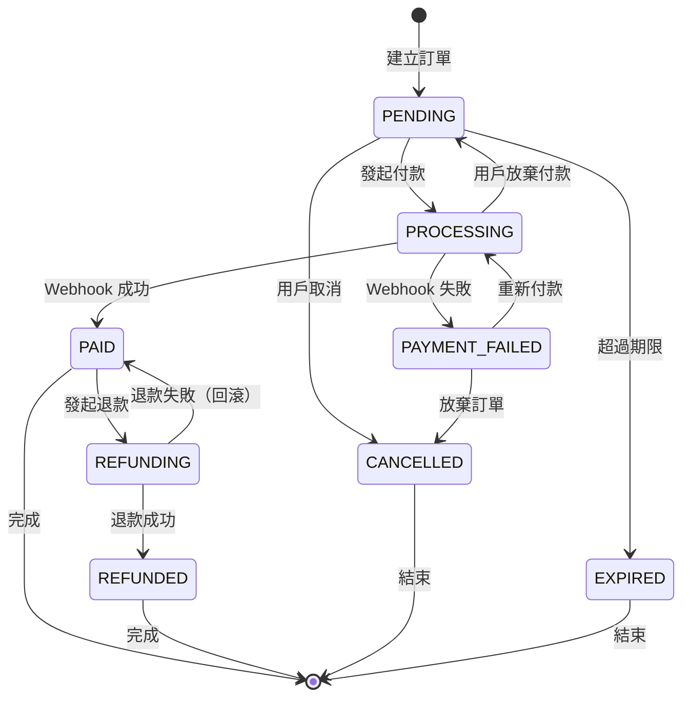

# 藍新金流信用卡一次付清 - High Level Design

> **版本**: v1.0  
> **日期**: 2025-12-20  
> **範圍**: Phase 1 - PoC 金流串接（MPG 跳轉式信用卡一次付清）

---

## 0. PoC 快速串接指南 ⚡

### 0.1 最小可行串接（30 分鐘驗證）

**目標**：用最少程式碼驗證加解密正確、可成功跳轉藍新付款頁並接收回傳。

#### 前置準備

```
測試站 MPG 網址: https://ccore.newebpay.com/MPG/mpg_gateway
測試卡號: 4000-2211-1111-1111
有效期限: 任意未過期日期 (如 12/30)
安全碼: 222
```

#### Step 1: 建立加解密工具

```typescript
// lib/newebpay/crypto.ts
import crypto from 'crypto';

const HASH_KEY = process.env.NEWEBPAY_HASH_KEY!;
const HASH_IV = process.env.NEWEBPAY_HASH_IV!;

// AES-256-CBC 加密
export function encryptAES(data: string): string {
  const cipher = crypto.createCipheriv('aes-256-cbc', HASH_KEY, HASH_IV);
  let encrypted = cipher.update(data, 'utf8', 'hex');
  encrypted += cipher.final('hex');
  return encrypted;
}

// SHA256 簽章
export function generateSHA256(aesEncrypted: string): string {
  const raw = `HashKey=${HASH_KEY}&${aesEncrypted}&HashIV=${HASH_IV}`;
  return crypto.createHash('sha256').update(raw).digest('hex').toUpperCase();
}

// AES-256-CBC 解密
export function decryptAES(encrypted: string): string {
  const decipher = crypto.createDecipheriv('aes-256-cbc', HASH_KEY, HASH_IV);
  let decrypted = decipher.update(encrypted, 'hex', 'utf8');
  decrypted += decipher.final('utf8');
  return decrypted;
}
```

#### Step 2: 建立付款發起 API

```typescript
// app/api/payment/create/route.ts
import { encryptAES, generateSHA256 } from '@/lib/newebpay/crypto';

export async function POST(req: Request) {
  const { orderId, amount, itemDesc, email } = await req.json();
  
  const tradeInfo = new URLSearchParams({
    MerchantID: process.env.NEWEBPAY_MERCHANT_ID!,
    RespondType: 'JSON',
    TimeStamp: String(Math.floor(Date.now() / 1000)),
    Version: '2.0',
    MerchantOrderNo: orderId,
    Amt: String(amount),
    ItemDesc: itemDesc,
    Email: email,
    CREDIT: '1',                    // 啟用信用卡
    NotifyURL: `${process.env.BASE_URL}/api/payment/notify`,
    ReturnURL: `${process.env.BASE_URL}/payment/result`,
  }).toString();

  const aesEncrypted = encryptAES(tradeInfo);
  const sha256 = generateSHA256(aesEncrypted);

  return Response.json({
    MerchantID: process.env.NEWEBPAY_MERCHANT_ID,
    TradeInfo: aesEncrypted,
    TradeSha: sha256,
    Version: '2.0',
    PaymentUrl: 'https://ccore.newebpay.com/MPG/mpg_gateway' // 測試站
  });
}
```

#### Step 3: 前端跳轉表單

```tsx
// components/PaymentForm.tsx
'use client';
export function PaymentForm({ paymentData }: { paymentData: PaymentData }) {
  return (
    <form method="POST" action={paymentData.PaymentUrl}>
      <input type="hidden" name="MerchantID" value={paymentData.MerchantID} />
      <input type="hidden" name="TradeInfo" value={paymentData.TradeInfo} />
      <input type="hidden" name="TradeSha" value={paymentData.TradeSha} />
      <input type="hidden" name="Version" value={paymentData.Version} />
      <button type="submit">前往付款</button>
    </form>
  );
}
```

#### Step 4: Webhook 接收（NotifyURL）

```typescript
// app/api/payment/notify/route.ts
import { decryptAES, generateSHA256 } from '@/lib/newebpay/crypto';

export async function POST(req: Request) {
  const formData = await req.formData();
  const status = formData.get('Status') as string;
  const tradeInfo = formData.get('TradeInfo') as string;
  const tradeSha = formData.get('TradeSha') as string;

  // 1. 驗證 SHA256
  const expectedSha = generateSHA256(tradeInfo);
  if (tradeSha !== expectedSha) {
    console.error('SHA256 驗證失敗');
    return new Response('FAIL', { status: 400 });
  }

  // 2. 解密 TradeInfo
  const decrypted = decryptAES(tradeInfo);
  const result = JSON.parse(decrypted);
  
  console.log('付款結果:', { status, result });

  // 3. TODO: 更新訂單狀態（需檢查金額一致性）
  
  return new Response('OK'); // 必須回傳 HTTP 200
}
```

#### Step 5: 環境變數

```env
# .env.local
NEWEBPAY_MERCHANT_ID=你的商店代號
NEWEBPAY_HASH_KEY=你的HashKey（32字元）
NEWEBPAY_HASH_IV=你的HashIV（16字元）
BASE_URL=https://your-domain.com  # 或用 ngrok 暫時測試
```

### 0.2 PoC 驗證清單

| 檢查項目 | 預期結果 |
|---------|---------|
| 加密後可跳轉藍新頁面 | 看到信用卡輸入畫面 |
| 輸入測試卡號付款成功 | 顯示付款成功頁面 |
| NotifyURL 收到回傳 | Server log 有輸出 |
| 解密後金額正確 | Amt 與原始訂單一致 |
| TradeSha 驗證通過 | 無 SHA256 驗證錯誤 |

### 0.3 常見錯誤排查

| 錯誤代碼 | 原因 | 解法 |
|---------|-----|-----|
| MPG02004 | TimeStamp 過期 | 確保發動 API 後 120 秒內提交 |
| MPG03009 | SHA256 不符 | 檢查 HashKey/IV 是否正確、加密順序 |
| MPG01012 | 訂單編號格式錯誤 | 限英數字與底線，30 字內 |
| MPG03008 | 訂單編號重複 | 確保每筆交易唯一 |

---

## 1. 付款流程時序圖

### 1.1 完整付款流程（信用卡一次付清）



### 1.2 重要節點說明

| 節點 | 成功路徑 | 失敗路徑 | 備註 |
|-----|---------|---------|-----|
| 建立訂單 | 產生唯一訂單編號 | 回傳錯誤訊息 | 訂單編號格式：`ORD_YYYYMMDD_XXXXX` |
| 發起付款 | 成功加密並跳轉 | 加密失敗/參數錯誤 | TimeStamp 有效期 120 秒 |
| MPG 付款 | 授權成功 | 卡號錯誤/餘額不足/3D 驗證失敗 | 用戶操作 |
| Webhook 接收 | SHA256 驗證通過 | 驗證失敗/解密失敗 | 必須回傳 HTTP 200 |
| 金額驗證 | 回傳金額 = 訂單金額 | 金額不符（可能被竄改） | 關鍵安全檢查 |

---

## 2. Firestore Collection Schema

### 2.1 Collection 結構總覽

```
firestore/
├── orders/                    # 訂單主表
│   └── {orderId}/
├── transactions/              # 交易記錄
│   └── {transactionId}/
└── transactionLogs/           # 交易 Log（不可變）
    └── {logId}/
```

### 2.2 orders Collection

```json
{
  "_collectionPath": "orders/{orderId}",
  "_description": "訂單主表，記錄商業邏輯層面的訂單資訊",
  
  "orderId": "ORD_20251220_A1B2C",
  "merchantOrderNo": "ORD20251220A1B2C",
  
  "userId": "user_abc123",
  "userEmail": "user@example.com",
  
  "items": [
    {
      "productId": "prod_001",
      "productName": "線上課程 A",
      "quantity": 1,
      "unitPrice": 1500
    }
  ],
  
  "amount": 1500,
  "currency": "TWD",
  "itemDesc": "線上課程 A",
  
  "status": "PENDING",
  
  "paymentInfo": {
    "transactionId": "TXN_xxxxx",
    "paidAt": null,
    "paymentMethod": null
  },
  
  "metadata": {
    "source": "web",
    "campaign": null,
    "notes": null
  },
  
  "createdAt": "2025-12-20T10:00:00.000Z",
  "updatedAt": "2025-12-20T10:00:00.000Z"
}
```

**Order Status 狀態定義**：

| Status | 說明 | 觸發條件 |
|--------|-----|---------|
| `PENDING` | 待付款 | 訂單建立 |
| `PROCESSING` | 付款處理中 | 用戶跳轉至藍新 |
| `PAID` | 已付款 | Webhook 確認成功 |
| `PAYMENT_FAILED` | 付款失敗 | Webhook 確認失敗 |
| `EXPIRED` | 已過期 | 超過付款期限 |
| `CANCELLED` | 已取消 | 用戶/系統取消 |
| `REFUNDED` | 已退款 | 完成退款流程 |

### 2.3 transactions Collection

```json
{
  "_collectionPath": "transactions/{transactionId}",
  "_description": "交易記錄，對應藍新金流的每筆交易",
  
  "transactionId": "TXN_20251220_X1Y2Z",
  "orderId": "ORD_20251220_A1B2C",
  "merchantOrderNo": "ORD20251220A1B2C",
  
  "merchantId": "MS12345678",
  "tradeNo": "24122014301234567",
  
  "amount": 1500,
  "currency": "TWD",
  
  "status": "INITIATED",
  
  "paymentType": "CREDIT",
  "paymentMethod": null,
  
  "creditCardInfo": {
    "card6No": "400022",
    "card4No": "1111",
    "authBank": "Esun",
    "authCode": "A12345",
    "respondCode": "00",
    "eci": "5",
    "inst": 0,
    "instFirst": 0,
    "instEach": 0
  },
  
  "newebpayResponse": {
    "status": "SUCCESS",
    "message": "授權成功",
    "rawTradeInfo": "<encrypted_string>",
    "decryptedResult": {}
  },
  
  "verification": {
    "tradeShaValid": true,
    "amountMatched": true,
    "checkCodeValid": true
  },
  
  "timestamps": {
    "initiatedAt": "2025-12-20T10:00:00.000Z",
    "submittedAt": "2025-12-20T10:00:30.000Z",
    "notifiedAt": "2025-12-20T10:01:00.000Z",
    "completedAt": "2025-12-20T10:01:00.000Z"
  },
  
  "ip": "203.145.xxx.xxx",
  
  "createdAt": "2025-12-20T10:00:00.000Z",
  "updatedAt": "2025-12-20T10:01:00.000Z"
}
```

**Transaction Status 狀態定義**：

| Status | 說明 |
|--------|-----|
| `INITIATED` | 已發起（產生加密資料） |
| `SUBMITTED` | 已提交（用戶跳轉藍新） |
| `PENDING_3D` | 等待 3D 驗證 |
| `SUCCESS` | 交易成功 |
| `FAILED` | 交易失敗 |
| `CANCELLED` | 已取消授權 |

### 2.4 transactionLogs Collection

```json
{
  "_collectionPath": "transactionLogs/{logId}",
  "_description": "交易 Log，不可變更，用於除錯與對帳",
  "_indexHint": "建議建立 transactionId + createdAt 複合索引",
  
  "logId": "LOG_xxxxxx",
  "transactionId": "TXN_20251220_X1Y2Z",
  "orderId": "ORD_20251220_A1B2C",
  "merchantOrderNo": "ORD20251220A1B2C",
  
  "logType": "NOTIFY_RECEIVED",
  
  "direction": "INBOUND",
  
  "requestData": {
    "method": "POST",
    "url": "/api/payment/notify",
    "headers": {
      "content-type": "application/x-www-form-urlencoded"
    },
    "body": {
      "Status": "SUCCESS",
      "MerchantID": "MS12345678",
      "TradeInfo": "<encrypted>",
      "TradeSha": "<sha256>"
    }
  },
  
  "responseData": {
    "statusCode": 200,
    "body": "OK"
  },
  
  "processingResult": {
    "success": true,
    "tradeShaValid": true,
    "decryptSuccess": true,
    "amountMatched": true,
    "error": null
  },
  
  "decryptedTradeInfo": {
    "Status": "SUCCESS",
    "Message": "授權成功",
    "Result": {}
  },
  
  "duration": 45,
  
  "createdAt": "2025-12-20T10:01:00.000Z"
}
```

**Log Type 類型**：

| LogType | Direction | 說明 |
|---------|-----------|-----|
| `REQUEST_CREATED` | OUTBOUND | 產生付款請求 |
| `MPG_REDIRECT` | OUTBOUND | 跳轉至藍新 |
| `NOTIFY_RECEIVED` | INBOUND | 收到 Webhook |
| `RETURN_RECEIVED` | INBOUND | 用戶返回 |
| `QUERY_REQUEST` | OUTBOUND | 主動查詢交易 |
| `QUERY_RESPONSE` | INBOUND | 查詢結果 |

### 2.5 Firestore 索引建議

```json
{
  "indexes": [
    {
      "collectionGroup": "orders",
      "fields": [
        { "fieldPath": "userId", "order": "ASCENDING" },
        { "fieldPath": "createdAt", "order": "DESCENDING" }
      ]
    },
    {
      "collectionGroup": "orders",
      "fields": [
        { "fieldPath": "status", "order": "ASCENDING" },
        { "fieldPath": "createdAt", "order": "DESCENDING" }
      ]
    },
    {
      "collectionGroup": "transactions",
      "fields": [
        { "fieldPath": "orderId", "order": "ASCENDING" },
        { "fieldPath": "createdAt", "order": "DESCENDING" }
      ]
    },
    {
      "collectionGroup": "transactionLogs",
      "fields": [
        { "fieldPath": "transactionId", "order": "ASCENDING" },
        { "fieldPath": "createdAt", "order": "ASCENDING" }
      ]
    }
  ]
}
```

---

## 3. API Endpoints 規格

### 3.1 API 總覽

| Method | Endpoint | 說明 |
|--------|----------|-----|
| POST | `/api/orders` | 建立訂單 |
| POST | `/api/payment/create` | 發起付款 |
| POST | `/api/payment/notify` | Webhook 接收 |
| GET | `/api/payment/status/{orderId}` | 查詢付款狀態 |

### 3.2 OpenAPI 規格 (YAML)

```yaml
openapi: 3.0.3
info:
  title: EdTech Payment API
  version: 1.0.0
  description: 藍新金流信用卡一次付清串接 API

servers:
  - url: https://api.example.com
    description: Production
  - url: http://localhost:3000
    description: Development

paths:
  /api/orders:
    post:
      summary: 建立訂單
      operationId: createOrder
      tags: [Orders]
      requestBody:
        required: true
        content:
          application/json:
            schema:
              $ref: '#/components/schemas/CreateOrderRequest'
      responses:
        '201':
          description: 訂單建立成功
          content:
            application/json:
              schema:
                $ref: '#/components/schemas/CreateOrderResponse'
        '400':
          $ref: '#/components/responses/BadRequest'

  /api/payment/create:
    post:
      summary: 發起付款
      operationId: createPayment
      tags: [Payment]
      requestBody:
        required: true
        content:
          application/json:
            schema:
              $ref: '#/components/schemas/CreatePaymentRequest'
      responses:
        '200':
          description: 付款資料產生成功
          content:
            application/json:
              schema:
                $ref: '#/components/schemas/CreatePaymentResponse'
        '400':
          $ref: '#/components/responses/BadRequest'
        '404':
          $ref: '#/components/responses/NotFound'

  /api/payment/notify:
    post:
      summary: 藍新 Webhook 接收
      operationId: paymentNotify
      tags: [Payment]
      requestBody:
        required: true
        content:
          application/x-www-form-urlencoded:
            schema:
              $ref: '#/components/schemas/NewebPayNotifyRequest'
      responses:
        '200':
          description: 接收成功
          content:
            text/plain:
              schema:
                type: string
                example: 'OK'

  /api/payment/status/{orderId}:
    get:
      summary: 查詢付款狀態
      operationId: getPaymentStatus
      tags: [Payment]
      parameters:
        - name: orderId
          in: path
          required: true
          schema:
            type: string
      responses:
        '200':
          description: 查詢成功
          content:
            application/json:
              schema:
                $ref: '#/components/schemas/PaymentStatusResponse'
        '404':
          $ref: '#/components/responses/NotFound'

components:
  schemas:
    CreateOrderRequest:
      type: object
      required: [userId, items, email]
      properties:
        userId:
          type: string
        email:
          type: string
          format: email
        items:
          type: array
          items:
            $ref: '#/components/schemas/OrderItem'

    OrderItem:
      type: object
      required: [productId, productName, quantity, unitPrice]
      properties:
        productId:
          type: string
        productName:
          type: string
        quantity:
          type: integer
          minimum: 1
        unitPrice:
          type: integer
          minimum: 1

    CreateOrderResponse:
      type: object
      properties:
        orderId:
          type: string
        merchantOrderNo:
          type: string
        amount:
          type: integer
        status:
          type: string
          enum: [PENDING]
        createdAt:
          type: string
          format: date-time

    CreatePaymentRequest:
      type: object
      required: [orderId]
      properties:
        orderId:
          type: string

    CreatePaymentResponse:
      type: object
      properties:
        MerchantID:
          type: string
        TradeInfo:
          type: string
          description: AES 加密後的交易資料
        TradeSha:
          type: string
          description: SHA256 簽章
        Version:
          type: string
          example: '2.0'
        PaymentUrl:
          type: string
          format: uri
          description: MPG Gateway URL

    NewebPayNotifyRequest:
      type: object
      properties:
        Status:
          type: string
        MerchantID:
          type: string
        TradeInfo:
          type: string
        TradeSha:
          type: string
        Version:
          type: string

    PaymentStatusResponse:
      type: object
      properties:
        orderId:
          type: string
        status:
          type: string
          enum: [PENDING, PROCESSING, PAID, PAYMENT_FAILED, EXPIRED]
        amount:
          type: integer
        paidAt:
          type: string
          format: date-time
          nullable: true
        paymentMethod:
          type: string
          nullable: true

    ErrorResponse:
      type: object
      properties:
        code:
          type: string
        message:
          type: string
        details:
          type: object

  responses:
    BadRequest:
      description: 請求參數錯誤
      content:
        application/json:
          schema:
            $ref: '#/components/schemas/ErrorResponse'
    NotFound:
      description: 資源不存在
      content:
        application/json:
          schema:
            $ref: '#/components/schemas/ErrorResponse'
```

### 3.3 TypeScript Zod Schema

```typescript
// types/payment.ts
import { z } from 'zod';

// ===== Orders =====

export const OrderItemSchema = z.object({
  productId: z.string().min(1),
  productName: z.string().min(1).max(100),
  quantity: z.number().int().positive(),
  unitPrice: z.number().int().positive(),
});

export const CreateOrderRequestSchema = z.object({
  userId: z.string().min(1),
  email: z.string().email(),
  items: z.array(OrderItemSchema).min(1),
});

export const CreateOrderResponseSchema = z.object({
  orderId: z.string(),
  merchantOrderNo: z.string().max(30),
  amount: z.number().int().positive(),
  status: z.literal('PENDING'),
  createdAt: z.string().datetime(),
});

// ===== Payment Create =====

export const CreatePaymentRequestSchema = z.object({
  orderId: z.string().min(1),
});

export const CreatePaymentResponseSchema = z.object({
  MerchantID: z.string(),
  TradeInfo: z.string(),
  TradeSha: z.string().length(64), // SHA256 = 64 hex chars
  Version: z.string(),
  PaymentUrl: z.string().url(),
});

// ===== NewebPay Notify =====

export const NewebPayNotifyRequestSchema = z.object({
  Status: z.string(),
  MerchantID: z.string(),
  TradeInfo: z.string(),
  TradeSha: z.string(),
  Version: z.string().optional(),
});

// 解密後的 TradeInfo 結構（信用卡）
export const DecryptedTradeInfoSchema = z.object({
  Status: z.string(),
  Message: z.string(),
  Result: z.object({
    MerchantID: z.string(),
    Amt: z.number(),
    TradeNo: z.string(),
    MerchantOrderNo: z.string(),
    PaymentType: z.string(),
    RespondType: z.string(),
    PayTime: z.string(),
    IP: z.string(),
    EscrowBank: z.string().optional(),
    // 信用卡專屬
    AuthBank: z.string().optional(),
    RespondCode: z.string().optional(),
    Auth: z.string().optional(),
    Card6No: z.string().optional(),
    Card4No: z.string().optional(),
    Inst: z.number().optional(),
    InstFirst: z.number().optional(),
    InstEach: z.number().optional(),
    ECI: z.string().optional(),
    PaymentMethod: z.string().optional(),
  }),
});

// ===== Payment Status =====

export const PaymentStatusResponseSchema = z.object({
  orderId: z.string(),
  status: z.enum([
    'PENDING',
    'PROCESSING',
    'PAID',
    'PAYMENT_FAILED',
    'EXPIRED',
    'CANCELLED',
  ]),
  amount: z.number().int(),
  paidAt: z.string().datetime().nullable(),
  paymentMethod: z.string().nullable(),
});

// ===== Error =====

export const ErrorResponseSchema = z.object({
  code: z.string(),
  message: z.string(),
  details: z.record(z.unknown()).optional(),
});

// ===== Type Exports =====

export type OrderItem = z.infer<typeof OrderItemSchema>;
export type CreateOrderRequest = z.infer<typeof CreateOrderRequestSchema>;
export type CreateOrderResponse = z.infer<typeof CreateOrderResponseSchema>;
export type CreatePaymentRequest = z.infer<typeof CreatePaymentRequestSchema>;
export type CreatePaymentResponse = z.infer<typeof CreatePaymentResponseSchema>;
export type NewebPayNotifyRequest = z.infer<typeof NewebPayNotifyRequestSchema>;
export type DecryptedTradeInfo = z.infer<typeof DecryptedTradeInfoSchema>;
export type PaymentStatusResponse = z.infer<typeof PaymentStatusResponseSchema>;
export type ErrorResponse = z.infer<typeof ErrorResponseSchema>;
```

### 3.4 錯誤代碼定義

| Code | HTTP Status | 說明 |
|------|-------------|-----|
| `ORDER_NOT_FOUND` | 404 | 訂單不存在 |
| `ORDER_ALREADY_PAID` | 400 | 訂單已付款 |
| `ORDER_EXPIRED` | 400 | 訂單已過期 |
| `INVALID_AMOUNT` | 400 | 金額不正確 |
| `PAYMENT_VERIFICATION_FAILED` | 400 | 付款驗證失敗 |
| `SHA256_MISMATCH` | 400 | SHA256 簽章不符 |
| `DECRYPT_FAILED` | 500 | 解密失敗 |
| `AMOUNT_MISMATCH` | 400 | 回傳金額與訂單不符 |
| `DUPLICATE_NOTIFICATION` | 200 | 重複通知（冪等處理） |

### 3.5 冪等性設計

Webhook 可能重複發送，必須處理冪等性：

```typescript
// 在 Notify handler 中
async function handleNotify(merchantOrderNo: string, tradeNo: string) {
  // 1. 檢查是否已處理過此 TradeNo
  const existingTx = await db.collection('transactions')
    .where('tradeNo', '==', tradeNo)
    .where('status', '==', 'SUCCESS')
    .get();
  
  if (!existingTx.empty) {
    // 已處理過，記錄 log 但不重複更新
    await logTransaction('DUPLICATE_NOTIFICATION', { tradeNo });
    return { duplicate: true };
  }
  
  // 2. 使用 Transaction 確保原子性更新
  await db.runTransaction(async (t) => {
    const orderRef = db.collection('orders').doc(merchantOrderNo);
    const order = await t.get(orderRef);
    
    if (order.data()?.status === 'PAID') {
      return; // 已付款，跳過
    }
    
    t.update(orderRef, {
      status: 'PAID',
      'paymentInfo.paidAt': new Date(),
      updatedAt: new Date(),
    });
  });
}
```

---

## 4. 交易狀態機

### 4.1 狀態機圖



### 4.2 狀態轉換規則

```typescript
// types/orderStatus.ts
export const ORDER_STATUS_TRANSITIONS: Record<string, string[]> = {
  PENDING: ['PROCESSING', 'CANCELLED', 'EXPIRED'],
  PROCESSING: ['PAID', 'PAYMENT_FAILED', 'PENDING'],
  PAID: ['REFUNDING'],
  PAYMENT_FAILED: ['PROCESSING', 'CANCELLED'],
  REFUNDING: ['REFUNDED', 'PAID'],
  REFUNDED: [],
  CANCELLED: [],
  EXPIRED: [],
};

export function canTransition(from: string, to: string): boolean {
  return ORDER_STATUS_TRANSITIONS[from]?.includes(to) ?? false;
}

export function validateTransition(from: string, to: string): void {
  if (!canTransition(from, to)) {
    throw new Error(
      `Invalid status transition: ${from} -> ${to}`
    );
  }
}
```

### 4.3 狀態更新 Service

```typescript
// services/orderStatusService.ts
import { db } from '@/lib/firebase';
import { validateTransition } from '@/types/orderStatus';

export async function updateOrderStatus(
  orderId: string,
  newStatus: string,
  metadata?: Record<string, unknown>
) {
  return db.runTransaction(async (t) => {
    const orderRef = db.collection('orders').doc(orderId);
    const order = await t.get(orderRef);
    
    if (!order.exists) {
      throw new Error('Order not found');
    }
    
    const currentStatus = order.data()!.status;
    validateTransition(currentStatus, newStatus);
    
    t.update(orderRef, {
      status: newStatus,
      updatedAt: new Date(),
      ...metadata,
    });
    
    // 記錄狀態變更
    const logRef = db.collection('transactionLogs').doc();
    t.set(logRef, {
      orderId,
      logType: 'STATUS_CHANGE',
      previousStatus: currentStatus,
      newStatus,
      metadata,
      createdAt: new Date(),
    });
  });
}
```

---

## 5. 安全檢查清單

### 5.1 必要安全措施

| # | 檢查項目 | 實作方式 | 優先級 |
|---|---------|---------|-------|
| 1 | **TradeSha 簽章驗證** | 收到 Webhook 後，用相同方式產生 SHA256 比對 | 🔴 P0 |
| 2 | **金額二次驗證** | 解密後的 Amt 必須等於訂單原始金額 | 🔴 P0 |
| 3 | **冪等性處理** | 用 TradeNo 檢查是否已處理過 | 🔴 P0 |
| 4 | **HTTPS 強制** | NotifyURL / ReturnURL 必須是 HTTPS | 🔴 P0 |
| 5 | **敏感資料不落地** | 不儲存完整卡號，僅存 Card6No/Card4No | 🔴 P0 |
| 6 | **狀態機檢查** | 防止非法狀態跳躍 | 🟡 P1 |
| 7 | **TimeStamp 驗證** | 發起付款時 TimeStamp 在有效期內 | 🟡 P1 |
| 8 | **IP 白名單** | 限制 Webhook 來源 IP（選用） | 🟢 P2 |

### 5.2 安全實作範例

```typescript
// lib/newebpay/verify.ts
import { generateSHA256, decryptAES } from './crypto';
import { db } from '@/lib/firebase';

interface VerifyResult {
  valid: boolean;
  error?: string;
  decryptedData?: any;
}

export async function verifyNotifyPayload(
  tradeSha: string,
  tradeInfo: string,
  expectedAmount: number
): Promise<VerifyResult> {
  // 1. SHA256 驗證
  const calculatedSha = generateSHA256(tradeInfo);
  if (tradeSha !== calculatedSha) {
    return {
      valid: false,
      error: 'SHA256_MISMATCH',
    };
  }

  // 2. 解密
  let decryptedData: any;
  try {
    const decrypted = decryptAES(tradeInfo);
    decryptedData = JSON.parse(decrypted);
  } catch (e) {
    return {
      valid: false,
      error: 'DECRYPT_FAILED',
    };
  }

  // 3. 金額驗證
  const returnedAmount = decryptedData.Result?.Amt;
  if (returnedAmount !== expectedAmount) {
    return {
      valid: false,
      error: 'AMOUNT_MISMATCH',
      decryptedData,
    };
  }

  return {
    valid: true,
    decryptedData,
  };
}

// CheckCode 驗證（用於查詢 API 回傳）
export function verifyCheckCode(
  amt: number,
  merchantId: string,
  merchantOrderNo: string,
  tradeNo: string,
  receivedCheckCode: string
): boolean {
  const params = { Amt: amt, MerchantID: merchantId, MerchantOrderNo: merchantOrderNo, TradeNo: tradeNo };
  const sorted = Object.keys(params).sort();
  const queryString = sorted.map(k => `${k}=${params[k as keyof typeof params]}`).join('&');
  
  const hashIV = process.env.NEWEBPAY_HASH_IV!;
  const hashKey = process.env.NEWEBPAY_HASH_KEY!;
  const raw = `HashIV=${hashIV}&${queryString}&HashKey=${hashKey}`;
  
  const crypto = require('crypto');
  const calculated = crypto.createHash('sha256').update(raw).digest('hex').toUpperCase();
  
  return calculated === receivedCheckCode;
}
```

### 5.3 環境變數安全

```env
# 生產環境必須使用 Secret Manager 或類似服務
NEWEBPAY_MERCHANT_ID=MS12345678
NEWEBPAY_HASH_KEY=<from-secret-manager>  # 32 字元
NEWEBPAY_HASH_IV=<from-secret-manager>   # 16 字元

# 永遠不要把 HASH_KEY/IV 放在程式碼或 Git
```

---

## 6. 附錄

### 6.1 藍新金流測試資訊

| 項目 | 值 |
|-----|---|
| 測試站 MPG 網址 | https://ccore.newebpay.com/MPG/mpg_gateway |
| 正式站 MPG 網址 | https://core.newebpay.com/MPG/mpg_gateway |
| 測試卡號 | 4000-2211-1111-1111 |
| 有效期限 | 任意未過期日期 |
| 安全碼 | 222 |
| API 版本 | 2.0 (建議) / 2.3 (最新) |

### 6.2 TradeInfo 必填參數（信用卡一次付清）

| 參數 | 必填 | 說明 |
|-----|-----|-----|
| MerchantID | V | 商店代號 |
| RespondType | V | JSON 或 String |
| TimeStamp | V | Unix timestamp |
| Version | V | 2.0 |
| MerchantOrderNo | V | 訂單編號（30字內，英數字底線） |
| Amt | V | 金額（整數，新台幣） |
| ItemDesc | V | 商品描述（50字內） |
| CREDIT | - | 1 = 啟用信用卡 |
| NotifyURL | - | Webhook URL |
| ReturnURL | - | 前端返回 URL |
| Email | - | 消費者 Email |

### 6.3 參考文件

- 藍新金流技術文件：線上交易─幕前支付技術串接手冊 NDNF1.1.9
- [藍新金流測試站](https://cwww.newebpay.com/)
- [藍新金流正式站](https://www.newebpay.com/)

---

**文件結束**
