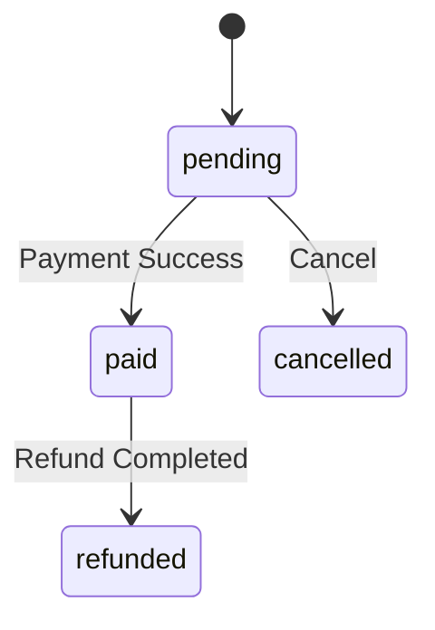
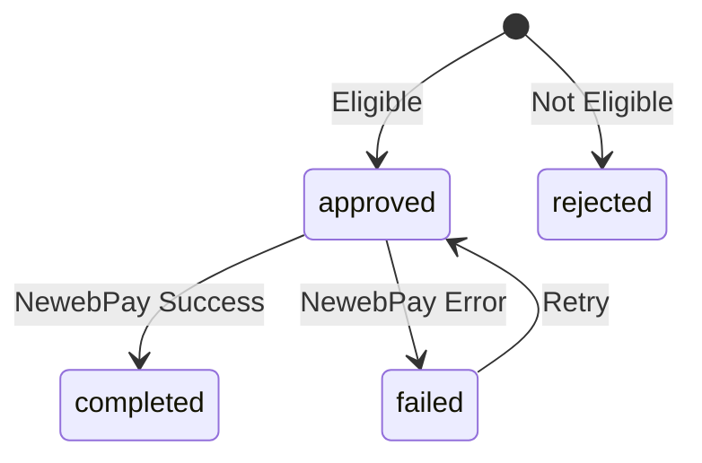
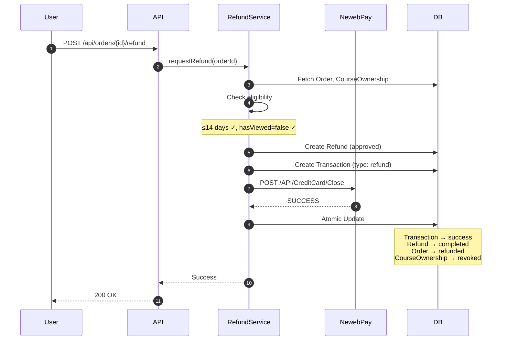
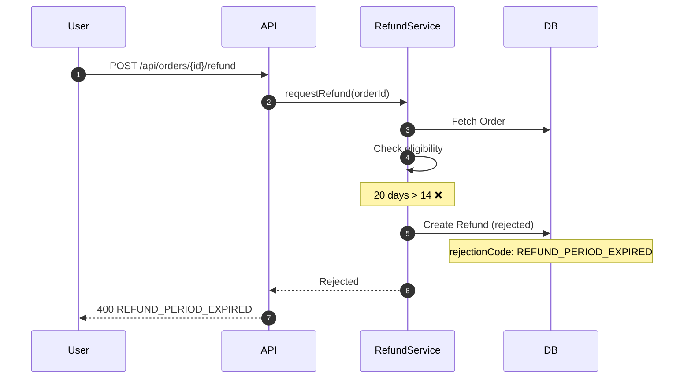
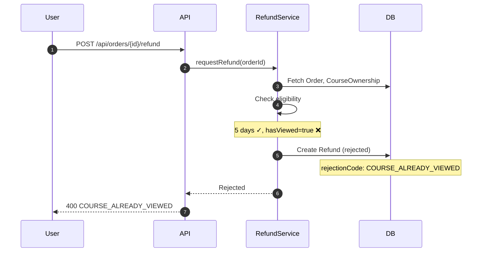
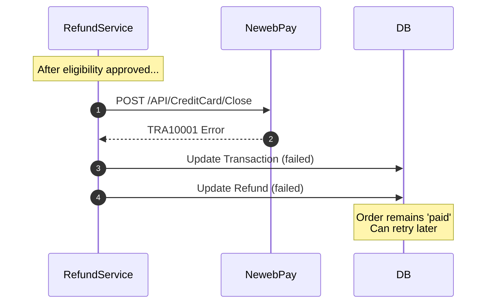

# Phase 2: Refund - High-Level Design

> **Version**: 1.0  
> **Date**: 2026-01-15  
> **Status**: Draft  
> **Prerequisites**: Phase 1 Complete

---

## 1. Overview

### 1.1 Goals

用戶可自助申請退款，系統自動審核並執行。

### 1.2 Refund Rules

```
✅ 可退款 = 購買 ≤14 天 AND hasViewed = false
❌ 不可退款 = 購買 >14 天 OR hasViewed = true
```

### 1.3 Key Decisions

| 項目 | 決策 |
|-----|------|
| 審核方式 | 自動審核 |
| 退款金額 | 全額退款 |
| 藍新手續費 | 平台吸收 |
| 分潤記錄 | Phase 2 不做 |

---

## 2. Database Schema

### 2.1 Schema Changes

```
Collections
├── Orders              # +status: 'refunded'
├── Transactions        # +type, +originalTransactionId
├── CourseOwnerships    # +hasViewed, +status（輔助欄位）
├── Courses             # +ownerId（未來分潤用）
└── Refunds             # 🆕
```

### 2.2 Orders (Modified)

```typescript
type OrderStatus = 
  | 'pending'
  | 'paid'
  | 'cancelled'
  | 'refunded';    // NEW
```

### 2.3 Transactions (Modified)

```typescript
interface TransactionDocument {
  // ... existing fields ...
  
  type: 'payment' | 'refund';              // NEW
  originalTransactionId: string | null;    // NEW: refund 指向原付款
}
```

### 2.4 CourseOwnerships (Modified)

```typescript
interface CourseOwnershipDocument {
  // Document ID: auto-generated
  
  userId: string;
  courseId: string;
  orderId: string | null;
  grantedAt: Timestamp;
  expiresAt: Timestamp | null;    // null=永久, 退款時設為當下
  
  // NEW
  hasViewed: boolean;             // 是否進入過課程
  status: 'active' | 'revoked';   // 輔助欄位，方便篩選
}
```

> **Note**: `status` 為輔助欄位，核心邏輯以 `expiresAt` 判斷有效性。

### 2.5 Courses (Modified)

```typescript
interface CourseDocument {
  // ... existing fields ...
  
  ownerId: string;      // NEW: 課程擁有者（未來分潤用）
}
```

### 2.6 Refunds (New)

```typescript
interface RefundDocument {
  // Document ID: auto-generated
  
  // References
  orderId: string;
  transactionId: string;              // 原付款交易
  refundTransactionId: string | null; // 退款交易
  
  // Amount
  amount: number;
  
  // Status
  status: RefundStatus;
  
  // Eligibility snapshot
  eligibility: {
    daysSincePurchase: number;
    hasViewed: boolean;
    isEligible: boolean;
  };
  
  // Rejection
  rejectionCode: RefundRejectionCode | null;
  
  // NewebPay
  newebpayTradeNo: string | null;
  
  // Timestamps
  createdAt: Timestamp;
  processedAt: Timestamp | null;
}

type RefundStatus = 
  | 'approved'      // 核准，執行中
  | 'completed'     // 完成
  | 'rejected'      // 拒絕（不符條件）
  | 'failed';       // 藍新 API 失敗

type RefundRejectionCode = 
  | 'ORDER_NOT_PAID'
  | 'ALREADY_REFUNDED'
  | 'REFUND_PERIOD_EXPIRED'
  | 'COURSE_ALREADY_VIEWED'
  | 'REFUND_IN_PROGRESS';
```

---

## 3. State Machine

### 3.1 Order Status



### 3.2 Refund Status



---

## 4. API Interfaces

### 4.1 POST /api/orders/{orderId}/refund

申請退款（自動審核 + 執行）

**Request**
```typescript
interface RefundRequest {
  reason?: string;
}
```

**Response - Success (200)**
```typescript
interface RefundSuccessResponse {
  success: true;
  refundId: string;
  amount: number;
}
```

**Response - Rejected (400)**
```typescript
interface RefundRejectedResponse {
  success: false;
  code: RefundRejectionCode;
  message: string;
}
```

**Response - Failed (500)**
```typescript
interface RefundFailedResponse {
  success: false;
  code: 'REFUND_FAILED';
  refundId: string;
}
```

### 4.2 GET /api/orders/{orderId}/refund/eligibility

檢查退款資格（前端顯示用）

**Response (200)**
```typescript
interface EligibilityResponse {
  canRefund: boolean;
  reason?: RefundRejectionCode;
  daysSincePurchase: number;
  hasViewed: boolean;
}
```

### 4.3 Trigger: hasViewed Update

當用戶呼叫 `GET /api/materials?courseId=xxx` 時，背景更新 `hasViewed = true`。

---

## 5. Sequence Diagrams

### 5.1 Refund - Approved & Completed



### 5.2 Refund - Rejected (Over 14 days)



### 5.3 Refund - Rejected (Already Viewed)



### 5.4 Refund - NewebPay Failed



---

## 6. Service Layer Interface

### 6.1 RefundService

```typescript
interface IRefundService {
  requestRefund(orderId: string, userId: string): Promise<RefundResult>;
  checkEligibility(orderId: string): Promise<EligibilityResult>;
  retryRefund(refundId: string): Promise<RefundResult>;
}
```

### 6.2 RefundRepository

```typescript
interface IRefundRepository {
  create(refund: Refund): Promise<string>;
  findByOrderId(orderId: string): Promise<Refund | null>;
  updateStatus(id: string, status: RefundStatus, data?: Partial<Refund>): Promise<void>;
}
```

### 6.3 PaymentGateway (Extended)

```typescript
interface IPaymentGateway {
  // Existing
  createPayment(...): Promise<PaymentData>;
  verifyAndParseNotification(...): Promise<NotificationResult>;
  
  // NEW
  requestRefund(params: RefundParams): Promise<RefundResult>;
}

interface RefundParams {
  merchantOrderNo: string;
  tradeNo: string;
  amount: number;
}
```

---

## 7. NewebPay Refund API

### 7.1 Endpoint

| Environment | URL |
|-------------|-----|
| Testing | `https://ccore.newebpay.com/API/CreditCard/Close` |
| Production | `https://core.newebpay.com/API/CreditCard/Close` |

### 7.2 Key Parameters

| Parameter | Description |
|-----------|-------------|
| Amt | 退款金額 |
| MerchantOrderNo | 原交易訂單編號 |
| TradeNo | 原交易藍新序號 |
| IndexType | 1 (使用 TradeNo) |
| CloseType | 2 (退款) |

### 7.3 Response

| Status | Meaning | Action |
|--------|---------|--------|
| SUCCESS | 退款成功 | Complete flow |
| TRA10001 | 交易失敗 | Mark failed, allow retry |
| TRA20024 | 金額超過可退 | Check amount |
| TRA20025 | 已退款 | Check duplicate |

---

## 8. Future: Revenue Tracking

Phase 2 不實作分潤，僅預留擴展點。

### 8.1 Current State

```typescript
// 目前平台 100% 收入，無需分潤計算
const REVENUE_CONFIG = {
  platformRate: 1.0,
  ownerRate: 0.0,
};
```

### 8.2 Future Options

**Option A: Course-level config**
```typescript
interface Course {
  ownerId: string;
  revenueConfig?: {
    platformRate: number;
    ownerRate: number;
  };
}
```

**Option B: Global config collection**
```typescript
// RevenueSplitConfigs collection
interface RevenueSplitConfig {
  ownerId: string;        // or 'default'
  platformRate: number;
  ownerRate: number;
  effectiveFrom: Timestamp;
}
```

**Option C: Record at payment time**
```typescript
// 付款成功時，在 Transaction 或獨立 Collection 記錄分潤快照
interface RevenueRecord {
  transactionId: string;
  ownerId: string;
  grossAmount: number;
  platformAmount: number;
  ownerAmount: number;
}
```

---

## 9. Appendix

### A. Refund Policy Summary

```
┌────────────────────────────────────────┐
│           Pallas 退款政策               │
├────────────────────────────────────────┤
│ ✅ 可退款：購買 14 天內且未瀏覽課程     │
│ ❌ 不可退：超過 14 天或已瀏覽課程       │
│ 💰 退款金額：全額退款                   │
│ ⏱️ 處理時間：3-5 個工作天               │
└────────────────────────────────────────┘
```

### B. Rejection Messages

| Code | Message |
|------|---------|
| ORDER_NOT_PAID | 訂單尚未付款 |
| ALREADY_REFUNDED | 訂單已退款 |
| REFUND_PERIOD_EXPIRED | 已超過 14 天退款期限 |
| COURSE_ALREADY_VIEWED | 已瀏覽過課程內容 |
| REFUND_IN_PROGRESS | 退款處理中 |

---

**End of Document**